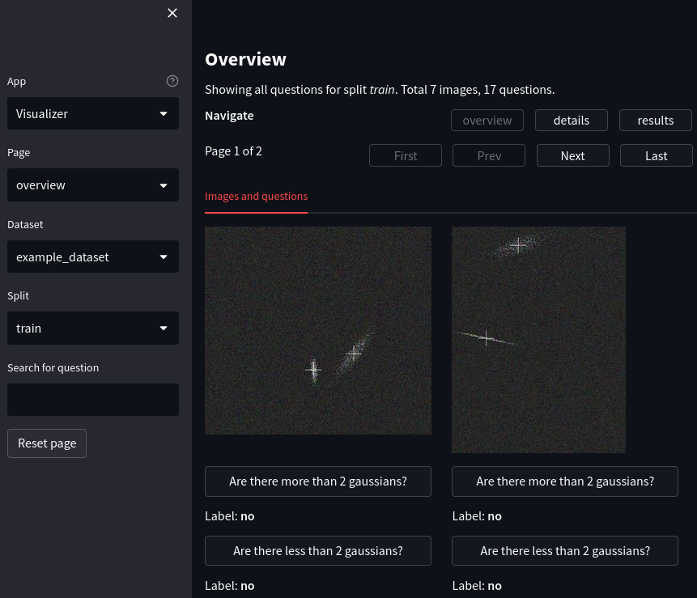

# streamlit-vis

A visualization example app for image datasets using streamlit.

The app visualizes a dummy visual question answering dataset and example model predictions.

[View demo](https://gingsi-streamlit-vis-run-app-u0qg70.streamlit.app/)

[See the gallery for screenshots.](#gallery)

## Setup

Clone, cd into, create environment with python>=3.7 and `pip install -r requirements.txt`

Tested with `python=3.9 streamlit=1.19.0`

## Usage

Start the streamlit server:

~~~bash
streamlit run run_app.py
~~~

This app is optimized for dark theme, activate it in the settings menu (top right).

See `.streamlit/config.toml` for the server settings.

## Features

- Supports hierarchical data: For one image there can be 1 to N questions.
- Basic filtering:
    - Datasets are divided into splits, here "train" and "val".
    - Questions are sorted into "number" and "yes/no" categories depending on their answer.
    - A search field can be used to search for specific questions.
- The **overview** page shows a grid of images and questions.
- The **details** page shows a single image-question pair and model predictions for this pair.
- The **results** page shows aggregated metrics per model and question category.
- Some CSS tricks are applied to overcome weaknesses of streamlit:
    - Image overview grid with a variable number of images per row depending on browser width.
    - `st.columns` that do not span the whole page.

## Gallery

## Version history

- 2023-03-05: Update to support streamlit 1.19.0
- 2023-02-24: Refactor to decouple example app and library code (no backwards compatibility)
- 2023-02-21: Initial version